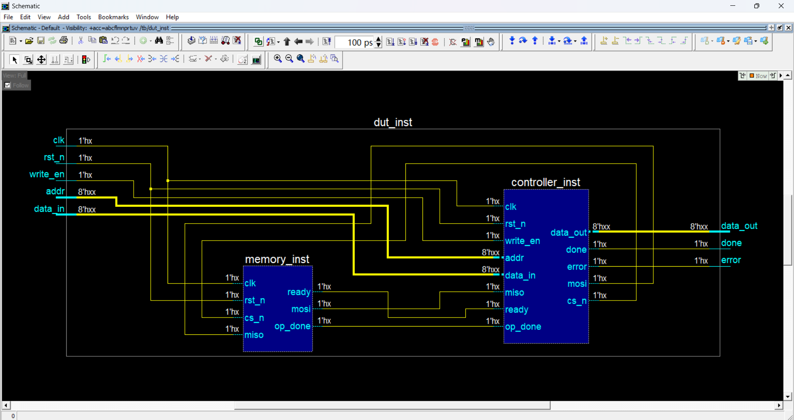
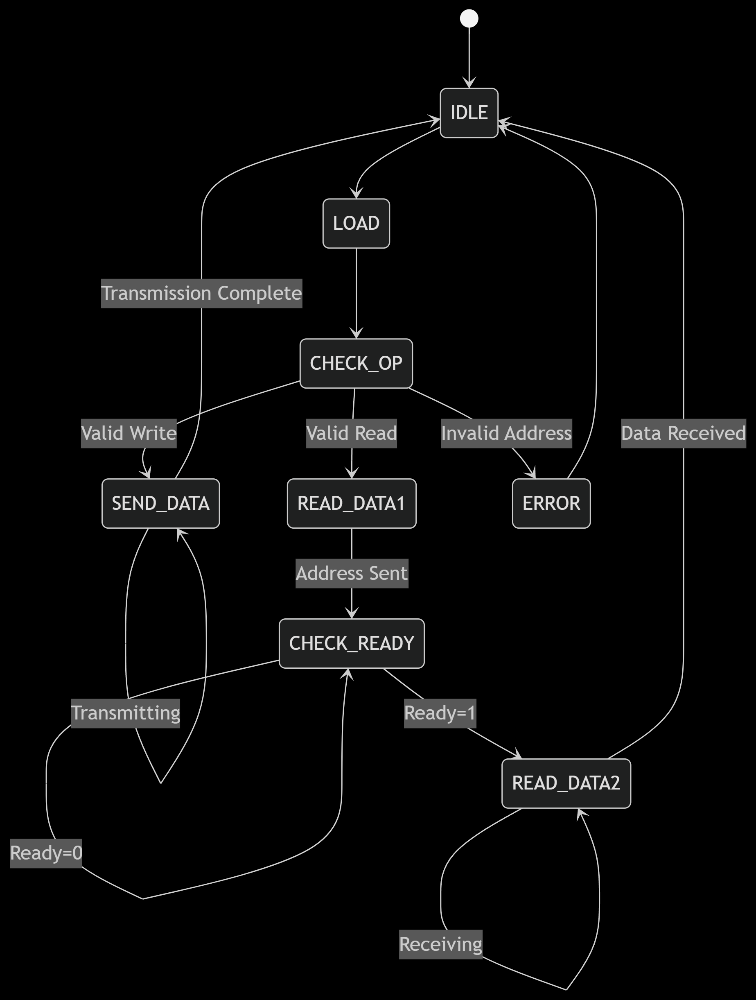
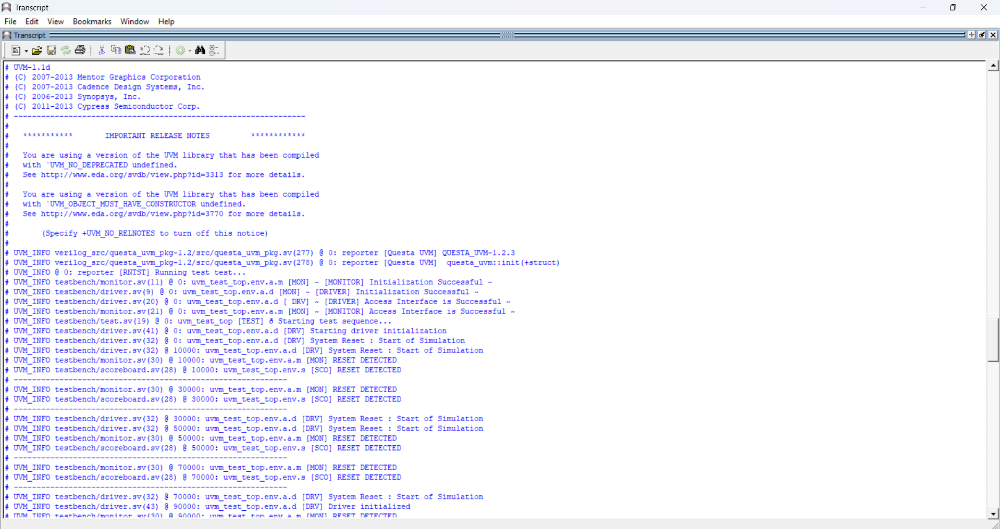
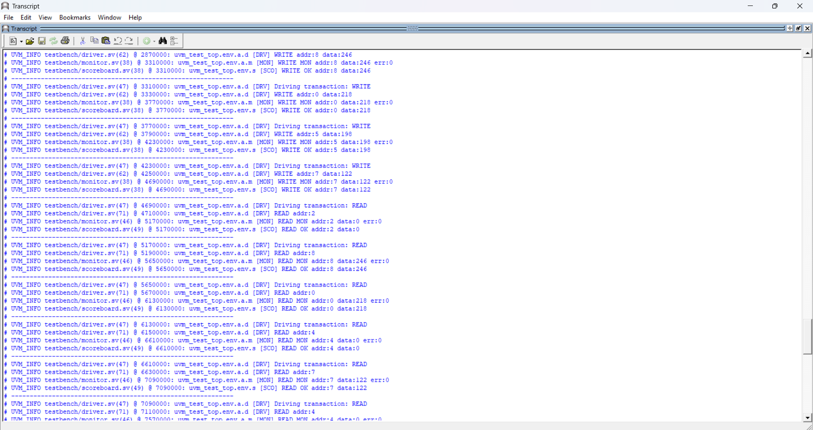
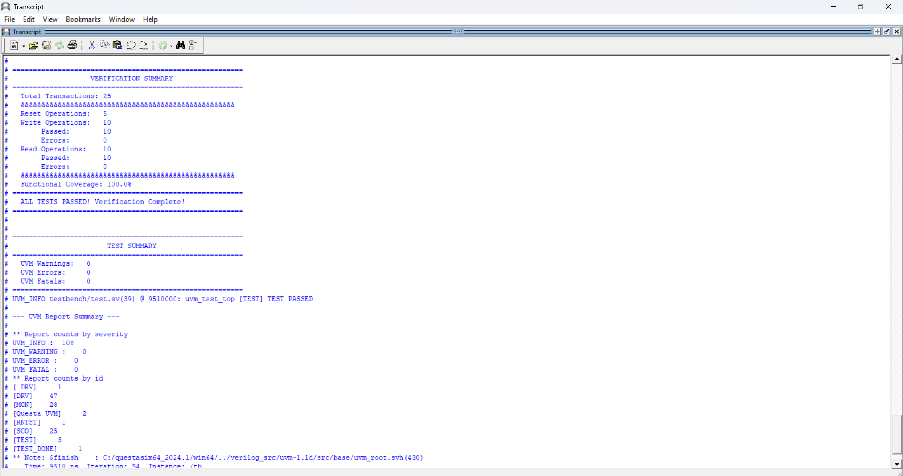

# Functional Verification of an SPI Memory Interface Using UVM

This project implements a modular **SPI (Serial Peripheral Interface) Controller** and verifies its functionality using a **UVM-based testbench**. The controller supports both **read and write operations** and ensures protocol correctness through a finite state machine (FSM)-based architecture.

---

## Project Overview

The SPI controller acts as a **master** and communicates with a **memory slave** module over an SPI interface. The controller supports:

- 8-bit **address** and **data**.
- Serialized **read** and **write** operations.
- Protocol-level control with `CS_N`, `MOSI`, `MISO`, and status signals [`error`, `done`].
- Robust **error handling** and status reporting.

This project also features **functional verification** using the **Universal Verification Methodology (UVM)** framework.

---

## SPI Controller Block Diagram

---

## FSM (Finite State Machine) Design

The controller uses an FSM to manage operation sequences:

- `IDLE`: Wait for transaction.
- `LOAD`: Load input data into internal shift register.
- `CHECK_OP`: Check for read/write enable.
- `SEND_DATA`: Serially transmit address and data.
- `SEND_ADDR`: Transmit address for read.
- `CHECK_READY [READ_DATA 1]`: Wait for memory to assert ready.
- `READ_DATA 2`: Receive read data from memory.
- `ERROR`: Triggered when an invalid operation or address occurs.

---

## Verification Output Results

The following test scenarios were verified:

- Write Operation
- Read Operation
- Read After Write (RAW)
- Invalid Address Handling
- Protocol Compliance

Below are some simulation waveforms:

---

